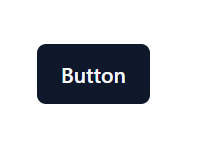
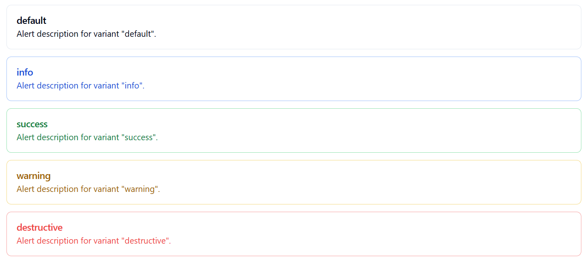
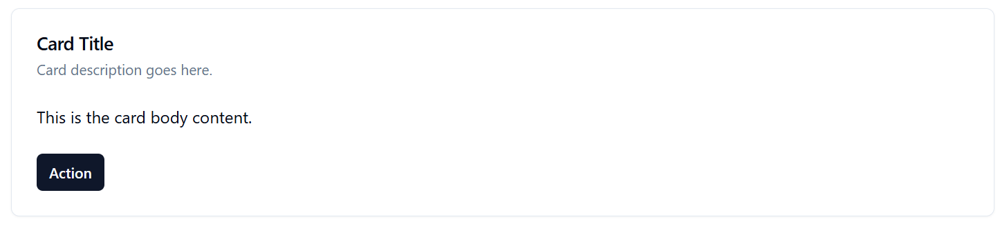
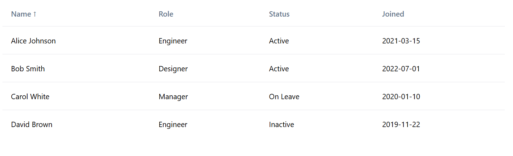
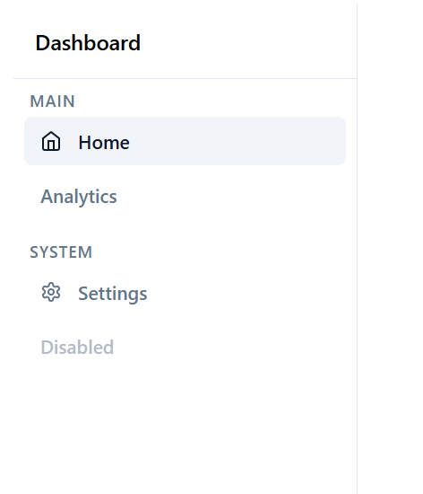
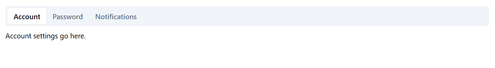

# @practics/ui

A React component library built with Tailwind CSS and Radix UI primitives.

## Installation

```bash
npm install @practics/ui
```

## Setup

Import the styles in your app's entry file:

```tsx
import "@practics/ui/styles";
```

Make sure your project has Tailwind CSS configured. The components use Tailwind classes and rely on your Tailwind setup for styling.

## Usage

```tsx
import { Button, Badge, Toaster } from "@practics/ui";

export default function App() {
  return (
    <div>
      <Button variant="default">Click me</Button>
      <Badge variant="success">Active</Badge>
      <Toaster position="bottom-right" />
    </div>
  );
}
```

## Preview

### Buttons & Badges



### Alerts


### Card & Table



### Navigation



## Components

### Layout
| Component | Description |
|---|---|
| `Box` | Base layout primitive with padding and display props |
| `Stack` | Flex container with direction, gap, align and justify |
| `Grid` | CSS grid container |
| `Container` | Max-width centered container |

### Inputs
| Component | Description |
|---|---|
| `Button` | Button with default, outline, ghost, destructive variants |
| `Input` | Text input field |
| `Textarea` | Multi-line text input |
| `Checkbox` | Checkbox with label support |
| `Select` | Dropdown select with option groups |

### Display
| Component | Description |
|---|---|
| `Badge` | Small label with success, warning, destructive variants |
| `Alert` | Contextual message with info, success, warning, destructive variants |
| `Avatar` | User avatar with image and fallback initials |
| `Card` | Content card with header, body and footer |
| `StatCard` | Metric card with trend indicator |
| `Progress` | Progress bar with size and variant options |

### Navigation
| Component | Description |
|---|---|
| `Breadcrumb` | Breadcrumb trail with mobile collapse support |
| `Tabs` | Tab navigation with mobile scroll support |
| `Sidebar` | App sidebar with mobile drawer support |

### Overlays
| Component | Description |
|---|---|
| `Dialog` | Modal dialog |
| `Toast` / `Toaster` | Toast notifications with position and variant support |

### Data
| Component | Description |
|---|---|
| `Table` | Static data table |
| `DataTable` | Sortable data table powered by TanStack Table |

## Storybook

Browse all components and their props live:
**[https://pravoobi.github.io/practics-ui](https://pravoobi.github.io/practics-ui)**

## Peer Dependencies

```json
{
  "react": "^18.0.0",
  "react-dom": "^18.0.0"
}
```

## License

ISC
