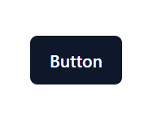
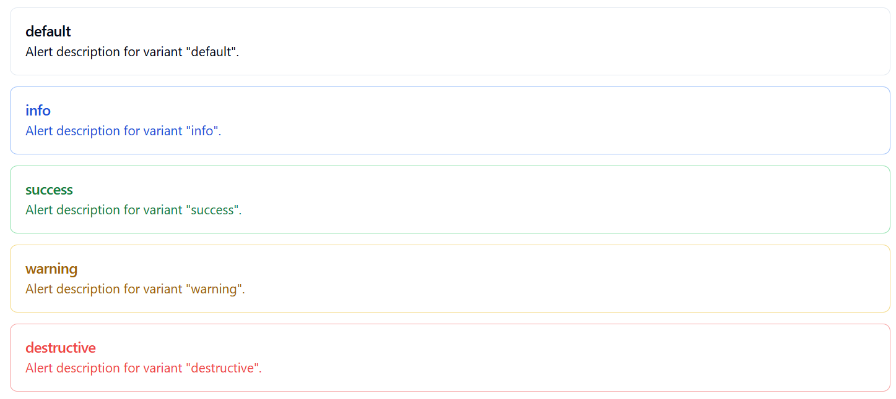
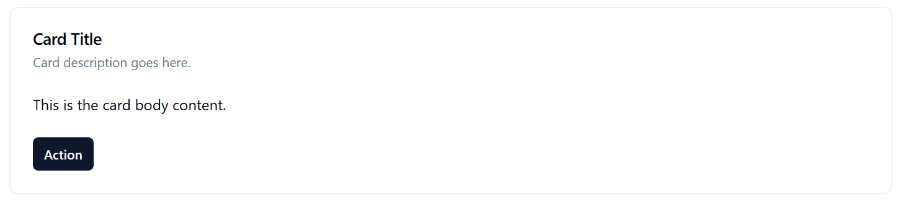
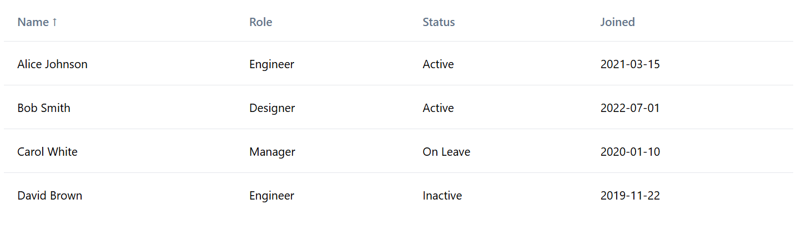
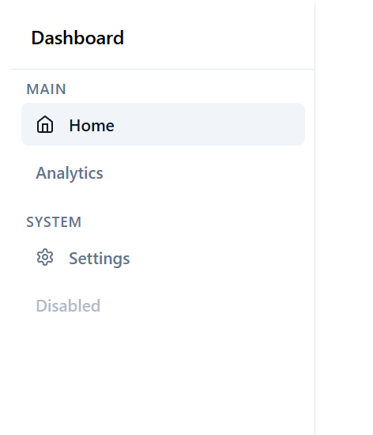
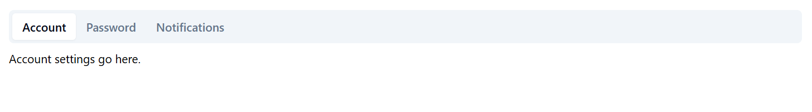
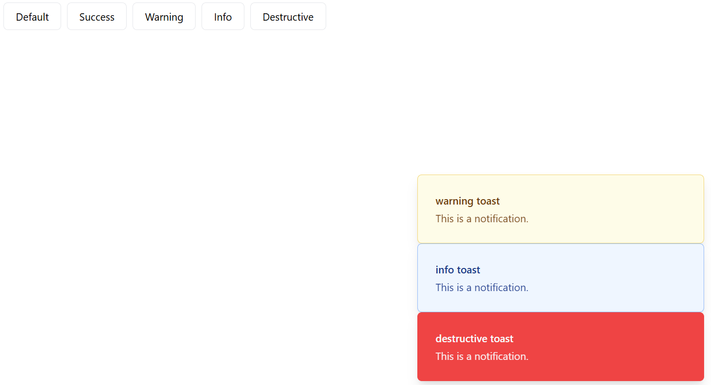

# @practics/ui

[](https://github.com/pravoobi/practics-ui/actions/workflows/ci.yml)
[](https://github.com/pravoobi/practics-ui/actions/workflows/publish.yml)
[](https://codecov.io/gh/pravoobi/practics-ui)
[](https://www.npmjs.com/package/@practics/ui)
[](https://www.npmjs.com/package/@practics/ui-mcp)
[](https://react.dev)

A React component library built with Tailwind CSS and Radix UI primitives.

## Installation

```bash
npm install @practics/ui
```

## Setup

Import the styles in your app's entry file:

```tsx
import "@practics/ui/styles";
```

Make sure your project has Tailwind CSS configured. The components use Tailwind classes and rely on your Tailwind setup for styling.

## Usage

```tsx
import { Button, Badge, Toaster } from "@practics/ui";

export default function App() {
  return (
    <div>
      <Button variant="default">Click me</Button>
      <Badge variant="success">Active</Badge>
      <Toaster position="bottom-right" />
    </div>
  );
}
```

## Preview

### Buttons & Badges



### Alerts


### Card & Table



### Navigation



### Toast


## Components

### Layout
| Component | Description |
|---|---|
| `Box` | Base layout primitive with padding and display props |
| `Stack` | Flex container with direction, gap, align and justify |
| `Grid` | CSS grid container |
| `Container` | Max-width centered container |

### Inputs
| Component | Description |
|---|---|
| `Button` | Button with default, outline, ghost, destructive variants |
| `Input` | Text input field |
| `Textarea` | Multi-line text input |
| `Checkbox` | Checkbox with label support |
| `Select` | Dropdown select with option groups |

### Display
| Component | Description |
|---|---|
| `Badge` | Small label with success, warning, destructive variants |
| `Alert` | Contextual message with info, success, warning, destructive variants |
| `Avatar` | User avatar with image and fallback initials |
| `Card` | Content card with header, body and footer |
| `StatCard` | Metric card with trend indicator |
| `Progress` | Progress bar with size and variant options |

### Navigation
| Component | Description |
|---|---|
| `Breadcrumb` | Breadcrumb trail with mobile collapse support |
| `Tabs` | Tab navigation with mobile scroll support |
| `Sidebar` | App sidebar with mobile drawer support |

### Overlays
| Component | Description |
|---|---|
| `Dialog` | Modal dialog |
| `Toast` / `Toaster` | Toast notifications with position and variant support |

### Data
| Component | Description |
|---|---|
| `Table` | Static data table |
| `DataTable` | Sortable data table powered by TanStack Table |

## AI agent integration (MCP)

`@practics/ui-mcp` is an [MCP server](https://modelcontextprotocol.io) that lets Claude Code, Cursor, and other AI coding agents query accurate component metadata instead of hallucinating prop names.

```json
// .mcp.json in your project root
{
  "mcpServers": {
    "practics-ui": {
      "command": "npx",
      "args": ["-y", "@practics/ui-mcp"]
    }
  }
}
```

Once configured, your agent can call tools like:

```
get_component("Button")        → full props, variants, examples
check_props("StatCard", {...}) → validates props before writing code
get_a11y_requirements("Input") → WCAG requirements + live axe results
search_components("modal")     → ranked component search
scaffold-form prompt           → generates react-hook-form + Zod form
```

**Performance** (50-iteration benchmark, `InMemoryTransport`):

| Tool | p50 | p95 | Cost/1k calls |
|---|---|---|---|
| `get_component` | 0.72ms | 1.10ms | $2.70 |
| `check_props` | 0.52ms | 2.92ms | $0.27 |
| `search_components` | 0.87ms | 3.84ms | $0.97 |

13/13 eval cases pass. Full details: [`mcp/README.md`](mcp/README.md)

## Storybook

Browse all components and their props live:
**[https://pravoobi.github.io/practics-ui](https://pravoobi.github.io/practics-ui)**

## Peer Dependencies

```json
{
  "react": "^18.0.0 || ^19.0.0",
  "react-dom": "^18.0.0 || ^19.0.0"
}
```

## License

ISC
